# Milestone Project 1

## 🎤 Introduction and Explanation

#### Course Layout:

Due to both the course layout and my ADHD I started my project after reading the Assessment Criteria section, the README information videos came after this and due to my ADHD I got on with the project without watching the videos or informationals that came after. Due to my nuero-diverse qualities I prefer to complete tasks in order. As a result of the above I did not start to write my README until after my initial completing of my website. It was only after this that I started watching the README informational videos that I suddenly realised my mistake. Hopefully to whoever reads this maybe you can pass this along to whoever created or edits the course content to maybe take this into consideration to help other future neuro-diverse individuals like myself. Ideas for this are possibly either changing the layout in which information is presented or simply making a bold statement in the first section stating something along the lines of 'Please study all parts and videos of this section before starting your project'.

#### GitHub / Commits

There are two Github repositaries associated with my project so Commits are spread between both. The main website was created on the alternative repositary (https://github.com/Grahamori/Milestone-Projects) to the one you are currently on whilst reading this. The main reason for this is due to my main repositary being intended to hold all four milestone projects which I later realised would not work when trying to host each individual project directly through Netlify, as Netlify would need the main index.html to be located within the main branch of the repositary in order to locate each project. Once this realisation was apparant I decided that I will in future make an individual repositary for each project. I will put this down to learning from my mistakes. 

Please Note: 

I am fully aware that I am severly lacking in the amount of commits, this has been mentioned and I was made aware after a discussion with my mentor. My mentor has offered to help guide me with this regard before starting my next milestone project. I have however tried to increase my commits since this was brought to my intention. (Please Note: This is also something that can be difficult for someone with ADHD, as we tend to get carried away completing tasks).

## 🖼️ Portfolio / Resume Project

#### Website URL : https://grahammilestoneproject1.netlify.app

## 🖼️ Am I Responsive Snapshot

### Index Page
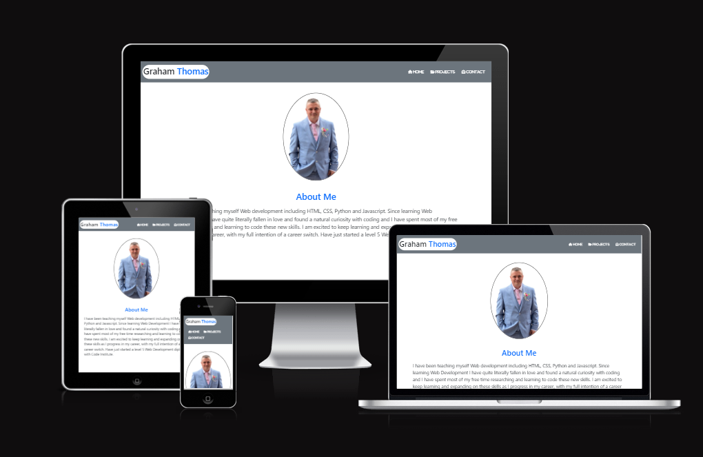

### Project Page

### Contact Page
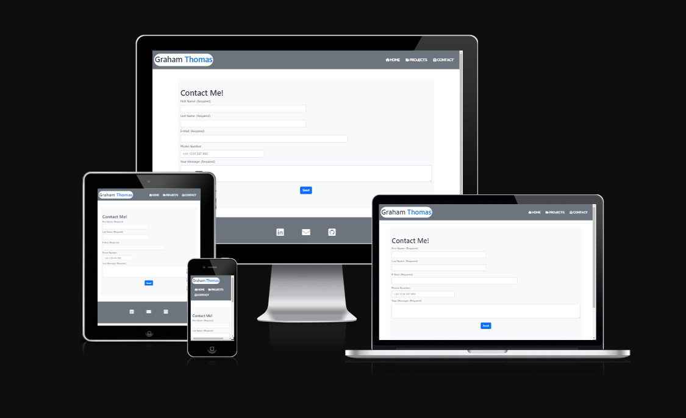

#### Website URL : https://ui.dev/amiresponsive?url=https://grahammilestoneproject1.netlify.app/

### 🎯 Strategy: 

I have decided that I will build a Resume / Portfolio website. The reason I have decided to do this project from the list of Project examples supplied by the course, is that I have made 3 other portfolio websites in the recent months before starting this course, but they have always been other peoples designs that have been copied through follow along videos on Youtube. I have always wanted to try and make one of my own design but never had the courage to start. 

This project will be for myself, the website will contain my own personal portfolio information which is real and not for a fictional person. Although the website will not immediately be used by myself in real life I may use it in the future as a structure to build upon and improve with the intention of possibly using it in real life circumstances. 

The goal of this website is to display my CV, a small text about myself and a live list of projects and  certifications that can be viewed by any potential employer. The projects, as well as having a live button to view the project will also have a button that will direct to the actual code that makes up the projects, which will be viewed through GitHub. There will also be a contact me page with a form for the potential employer to use to contact me through direct email message or via the use of social links which will be attached onto the footer of each page. 

### 🎯 Scope: 

The website will have the standard header and footer on each page. The header will have some form of simple logo and navigational links to each web page.  
I have decided that I want to keep the project simple, aesthetically pleasing to the eye and try not to overthink the design past my current capabilities.
I know from watching design idea videos on Youtube that the majority of social media suggestions state that simple is best. The employer will only be interested in the basic layout and structure of your design (a responsive and working website) and will more likely be targeting your projects, certifications and code examples.
The website will be fully responsive to the best of my ability and will have all fully working Links/Buttons.

### 🎯 Structure: 

The website structure will be kept simple and easy to navigate (for ease of use).

The main page will be kept simple with a small but non overpowering image of myself and below it a simple description of myself.
Below the about me section I will have an image of my real CV pdf that I created a few months ago and below that will be a working button to open and download that CV. 
 
The projects page will have a simple layout of bordered box around each project that will include a screenshot and title, also there will be two buttons within each project box that will link to both a live preview and the actual code displayed on GitHub. The certifications will also be displayed in a similar manner to the projects but without the navigational buttons. Each of the projects/certifications will be displayed side by side for the width of the page with small margin to separate each one.

The Contact page will also be kept very simple and will have a basic easy to use form which will include sections for first name, surname, email, phone number and finally a message section. There will be a submit button below the form. Haven’t fully decided if this will be a fully working form linked to a back-end yet as this would require the use of outside tutorials and help.  
 

### 🎯 Skeleton(includes proposed deployment information): 

This website will be written using GitPod as per our course guidance so far. As suggested in our project ideas and overview, I have decided not to use GitHub pages to display my finished project. Instead I will be using Netlify which I have become very familiar with over the past few months whilst teaching myself to code. Netlify is easy to use and has a tonne of great features including connecting to any GitHub repositary, Back-end email service, easy to drag and drop files/folders and free hosting.  

I will be using an easy to use wireframe design tool called Balsamiq to design my website and will be linking images of these designs below.

### 🎯 Surface: 

As for the finished look of the project I am not fully decided on which fonts to use yet or which colors. I’m gonna use a long known procedure of try and test before I decide which I’m going to use. I do however know that I do not want to use any bright and bold colors, I want to stay within the borders of my already decided simple design, and keep the layout, colors and styles simple yet aesthetically pleasing to the eye. 
So far I’m thinking along the lines of light blues, greens and greys, with simple and bold text fonts.

#### Update to Colors and Fonts:

As for both colors and fonts I have decided to stick with using Boostrap default built in colors and fonts, this is because I dont believe I have yet achieved the knowledge to edit the bootstrap CSS default scheme using SASS. Some project page colors may differ due to main content using separate CSS rules (non-bootstrap).

Decisions I have made for colors are as follows:

1. All default text will be bootstrap default color (black).
2. All button text will be text-white.
3. All buttons will have a bg-primary (blue) background.
4. Header, Footer and Navbar background color will be bg-secondary (grey).
5. Header, Footer(icons) and Navbar(including icons) text will be text-white, was text-light before changes/fixes.
6. Logo will be half default text color and half text-primary (blue).
7. Logo will have a bg-white background.
8. Main heading/section titles will be either default or text-primary (blue).

Project page(including differences):

1. Section headings will be lightgray.
2. Project and Certificate titles will be darkgray.
3. Buttons will have blue background with white text, and a black border.
4. Project and Certificate individual articles will have a lightgray background with a thin black border.

### 🎯 Wireframe of proposed website.

As I have never done a wireframe frame before it took a lot of research to figure out a simple tool to use for creating my wireframe. I decided to use Balsamiq as this look easy and simple to use compared to others I had found. Once I had created the wireframe for each page of my website I then had to figure out how I could show them on this ReadMe file, I decided to use my PC’s own snipping tool to copy sections of my wireframe  and save those sections as individual images. 

Below are those images. I have not incorporated any Tablet views into my wireframe due to the view that any tablet views would only be such small changes that those changes would not made any kind of real change in comparison to the desktop views. Instead I will write a small caption or text stating what those changes would be for the tablet view.

### 🎯 For the main page or index.html page:

#### 🖼️ Desktop View

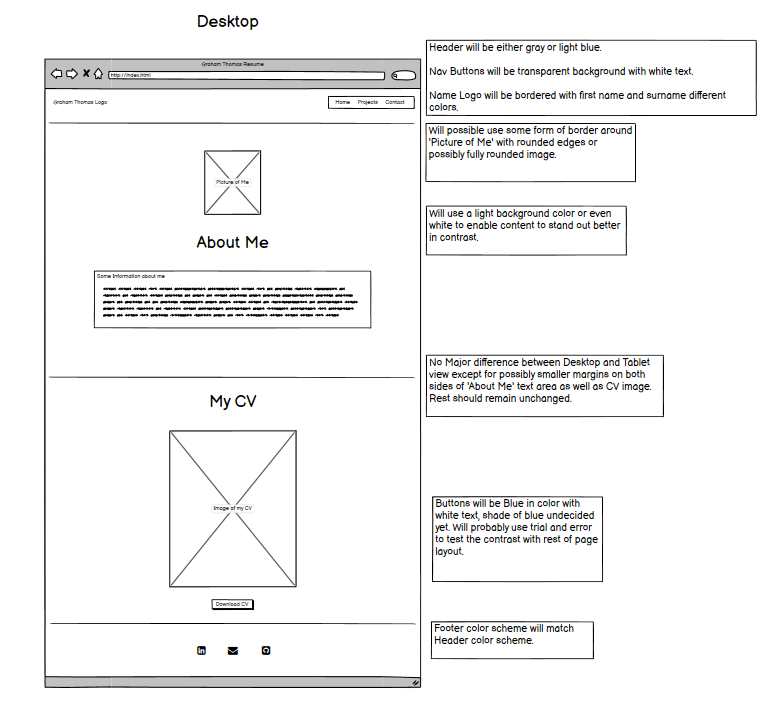

#### Tablet View

The changes between tablet and desktop view would in my opinion be very small, the only real changes would be the size of the side margins on the outside edge of the main content sections.
Everything else would remain the same.

#### 🖼️ Mobile View

### 🎯 For the Projects page:

#### 🖼️ Desktop View

#### 🖼️ Tablet View

#### 🖼️ Mobile View

### 🎯 For the Contact page:

#### 🖼️ Desktop View

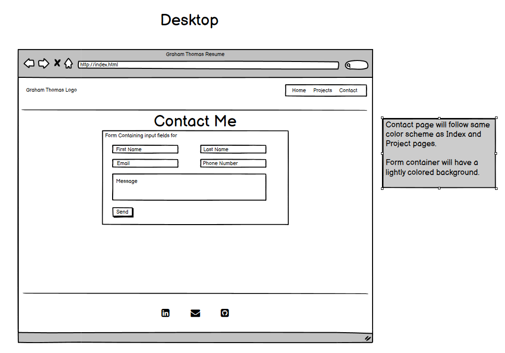

#### 🖼️ Tablet View

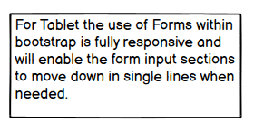

#### 🖼️ Mobile View

## 🎯 Adding the Content

### Steps in Order that I took from start to finish in order to complete my project website:

#### Index Page:

Will be using Bootstrap CSS for the Index page, Contact page and header/footer on all pages.

1. Created my basic index.html, project.html and contact.html files.
2. Started to layout the basic structure of my index.html page including header, footer, main content section, title and other meta tags including Bootstrap.
3. Created my main content structure for my index.html page with div elements.
4. Using the basic layout structure for the index.html, I then copied this and pasted onto both the project.html and contact.html in order to give all pages the same basic structure.
5. Then I practised add, commit and push to push content made so far onto Github, this is where I encountered my first issue, this was because I had taken a small break and GitPod had timed out. When I refreshed GidPod, the git push command was not working. Took a while to figure out what I had to do, but I did so many things I’m not sure which of these fixed the issue. My best guess is that I re-typed the command ‘git init’ into the terminal and needed to do this each time the session times out. This seemed to work for future time outs.
6. Started to create my header/navbar layout and this went well.
7. Added my links to the navbar page links and then encountered my second error. The links failed to work, took me about 10mins to realised I had put the 'a' tags within the 'i' tags instead of vice versa, this immediately fixed the issue.
8. Added FontAwesome meta tags and then added some icons to my navbar menu.
9. Added my name as a logo of header, using a span on surname with intention of making my surname a different color to first name.
10. Then I spent some time researching and adding Bootstrap CSS to my header, this took a while due to having to do a lot of research into bootstrap commands, as well as getting the positioning correct which took a few tries. The research was from https://getbootstrap.com/docs .
11. Spent some time adding color onto my header, decided to use the standard bootrap default colors for now.
12. Created the footer, added the social media icons (from FontAwesome)and links.
13. Added Bootstrap CSS to footer.
14. Updated the project and contact page with the header and footer that I created on the index.html page, plus meta tags that I had added.
15. Tested each page and social media links to make sure they were all working, realised I had forgotten to add ‘target=”blank” on the footer links so went and added those.
16. Started to add my About Me content, this was made up of a real image of me that I own and also the text about me was copied and pasted from my own real CV with a small amount of additional text added.
17. Added Bootstrap CSS to my image as it showed up huge. Then decided to add CSS to put a border around the image to make it stand out a little bit.
18. Added Bootstrap CSS to my text.
19. Added my CV image to CV section. Added Bootstrap CSS as yet again the image showed up huge, this was a little harder to get right until I realised I had forgotten to add sizing to the container.
The CV is my real image of my CV.pdf.
20. Added a download CV button. Added Bootstrap CSS to button. Added a working link to the button that enables you to download my Real CV.pdf.
21. Tested my main index.html page and checked that I was happy with the way it all looked.
22. Made some minor padding adjustments to the overall look of the index.html page.

#### 🖼️ Header Image:
 
  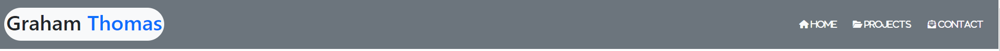
 
#### 🖼️ Footer Image:
 
  
 
#### 🖼️ About Me Content Image:
 
  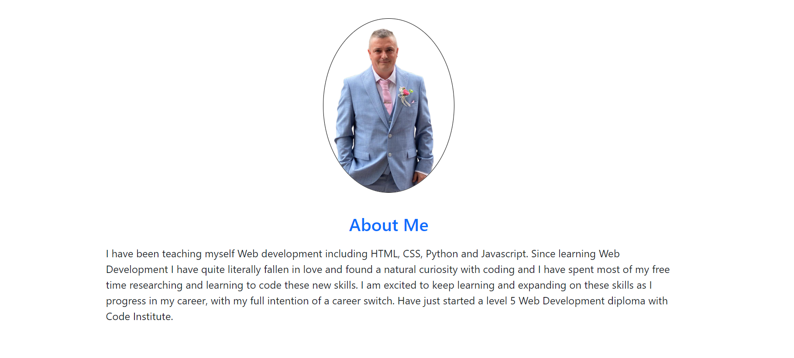
 
#### 🖼️ CV Content Image:
 
  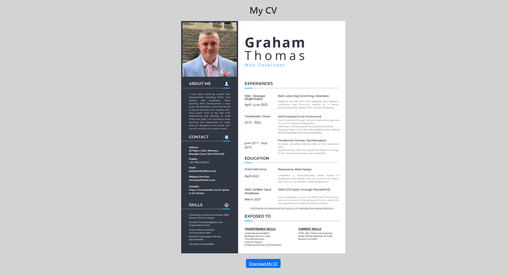

#### Project Page:

Will be using standard CSS with separate stylesheet for the main content of this page only, header and footer will incorporate same Bootstrap CSS as other pages.

1. Checked to make sure all html was up to date with what had been written on index page, mainly with regards to header and footer.
2. Added CSS file to project for the main content section of this page, as well as adding stylesheet in head section.
3. Tested menu and links for this page and content page as well.
4. Added the basic layout and structure for my main content on this page.
5. Added some real images of screenshots or real projects and certificates from my actual portfolio website.
6. Added the individual project images onto the html main section with titles and buttons.
7. Added working links to the buttons which was copied from my real CV Portfolio.
8. Added CSS but this took a while as I had some trouble with positioning of the project elements, had to look on www.w3schools.com for some positioning research.
9. Copied the project section into the certificate section of my html page but removed the button/links.
10. Edited the certificate images and titles until it was all changed from projects to certificates and correct.
11. Tested the page layout and all buttons and links worked correctly.
12. Small amount of CSS for adjustment.
 
#### 🖼️ Projects Content Image:
 
  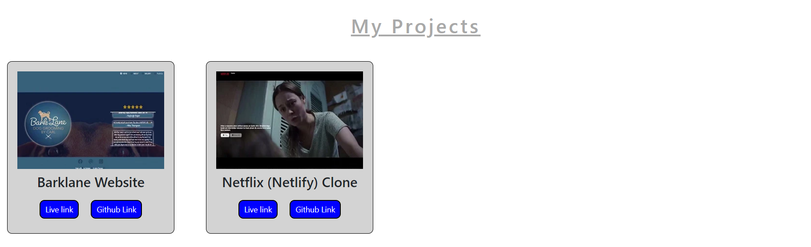
 
#### 🖼️ Certificates Content Image:
 
  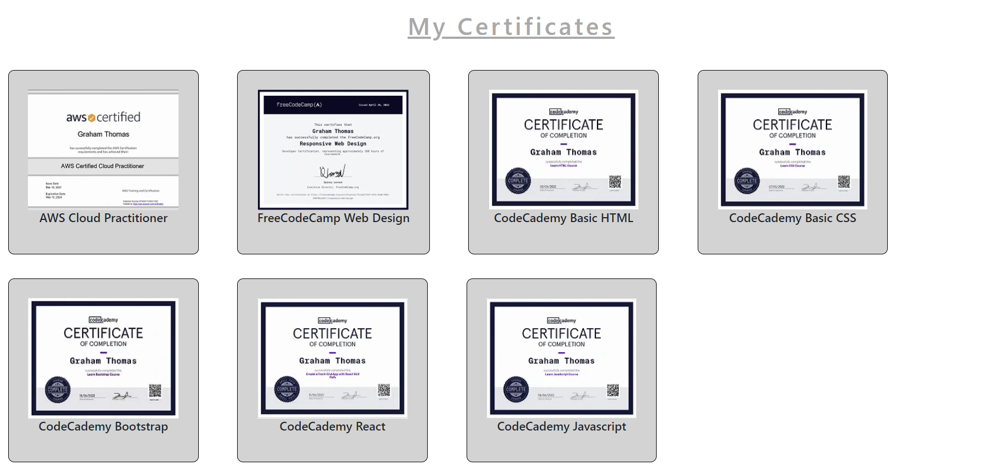

#### Contact Page:

1. Used www.w3schools.com to look up bootstrap forms and found one that I ended up using the basic bootstrap code from.
2. Edited code to my own liking for the form.
3. Changed only a small amount of Bootstrap CSS. The bootstrap CSS already added was fully responsive so didn’t need to edit/add much. 
 
#### 🖼️ Contact Form Image:
 
  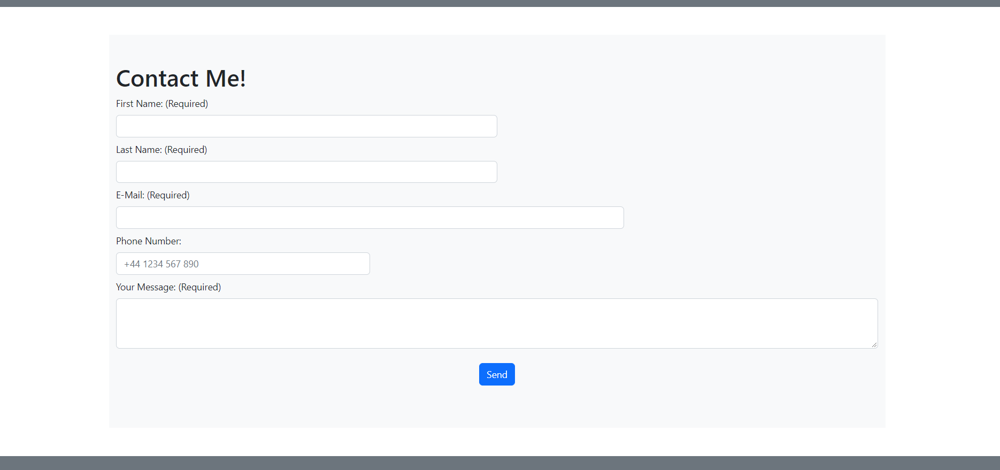

#### Additional After Steps:
 1. Tested the responsiveness of website and added some Media CSS onto separate stylesheet for main content section of project page.
 
 
 ## 🎯 Testing the Website
 
 ### 🎯 Lighthouse Report:
 
 #### 🖼️ My First Lighthouse Report:
 
 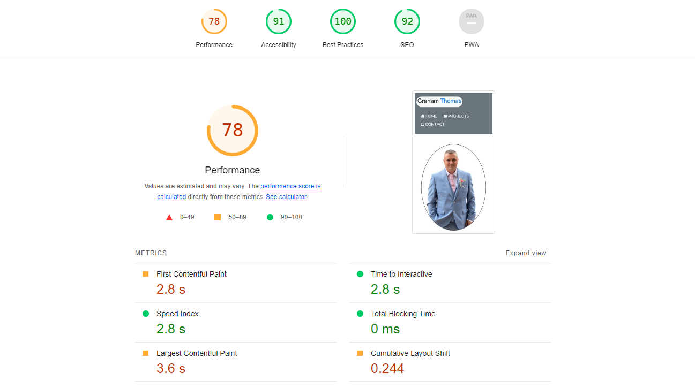
 
 #### Lighthouse Report Fixes (🖼️ Images Below Each Issue):
 
 1. Issue: SEO - Document does not have a meta description.
 
    Fix: Added meta description (plus author and keywords for good measure) to all head elements for each page.
 
    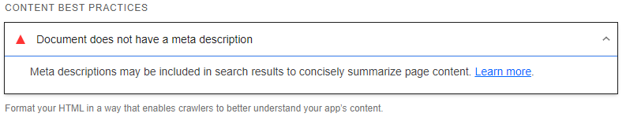

    
 2. Issue: Performance - Serve Images in next gen formats.
 
    Fix: Used www.freeconvert.com to convert my image to webp format. Then added Image to folder in GitHub and edited html for that image on index page.
 
    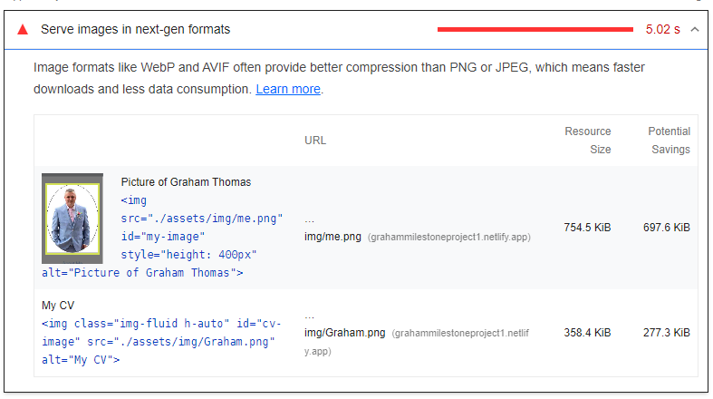
    
 3. Issue: Performance - Image elements do not have explicit width and height.
 
    Fix: Added auto width to inline style of image as height was already stated.
 
    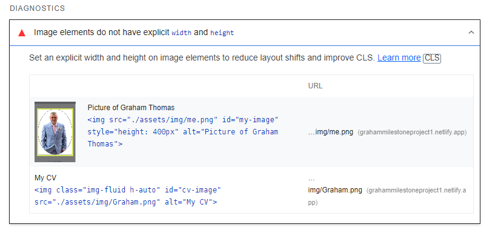
    
 4. Issue: Accessibility - Background and foreground colors have insufficient contrast ratio.
 
    Fix: Changed Bootstrap color from text-light to text-white for each element, then update all other html pages with same.
 
    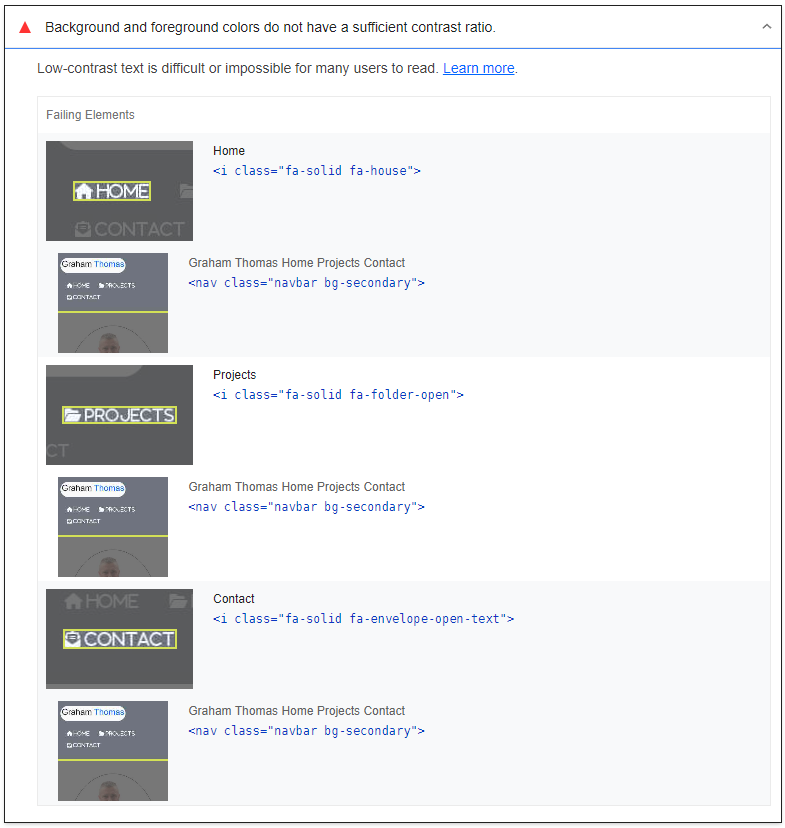
    
 #### 🖼️ My Final Lighthouse Report:
 
 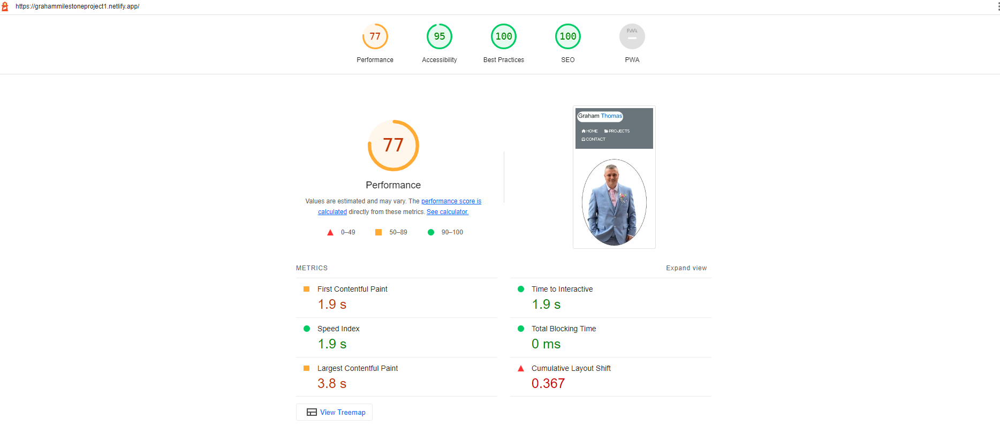
 
 #### Lighthouse Report Review:
 
 As you can see from my final report there has not been much improvement within the Performance section, This is mainly due to two things.
  1. First Contentful Paint - This has a major impact and after a lot of research I have been unable to find a solution at this point, so have no choice but to leave  this until I'm further along in my studies and understanding of web development.
  2. Eliminate Render Blocking Resources(🖼️ Image below) - As I can tell, this is caused by both script links for FontAwesome and Bootstrap CSS. As I need both of these links to enable my Website to stay the way in which I have designed it, then I can not see any way to remove these links.
 
 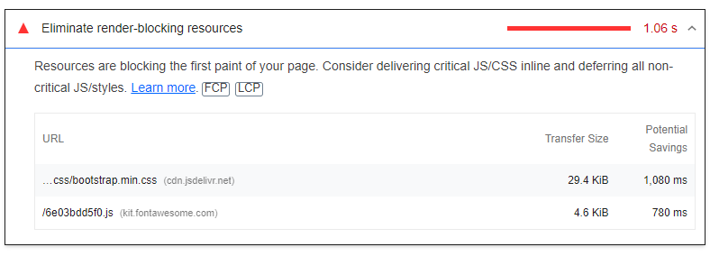
 
 ### 🎯 W3C Validator Report:
 
 #### 🖼️ My First W3C Report:
 
  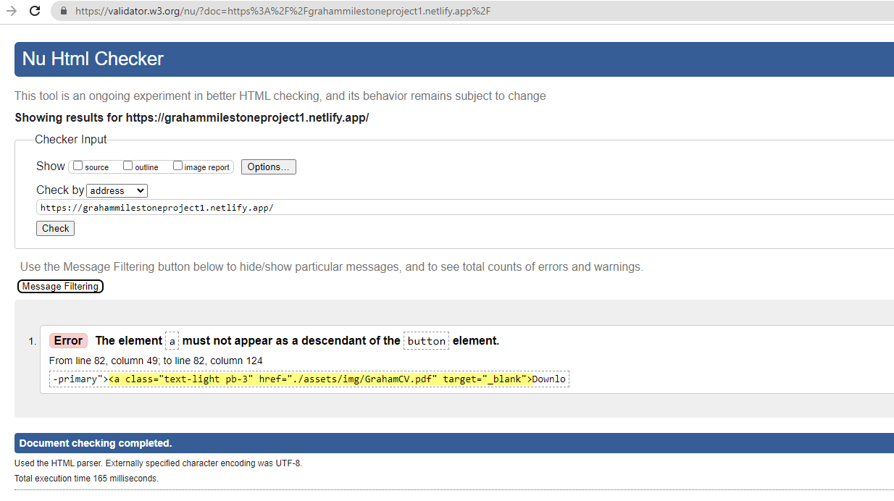
 
 #### W3C Fixes:
 
 1. Removed 'Button' element tags from 'a' element.
 2. Added Class attributes from 'button' onto the existing 'a' class.
 3. Ran W3C validator again.
 
 #### 🖼️ W3C Final Report:
 
  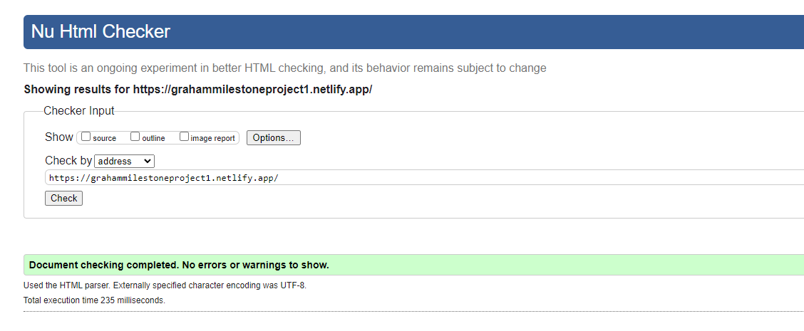
 
 ### 🎯 W3C Jigsaw CSS Report:
 
 ####  W3C Jigsaw Report Info(🖼️ Image Below):
 
 As You can see Below, there are only errors directly related to Bootstrap itself and no errors were present linking directly to my own code.
 
  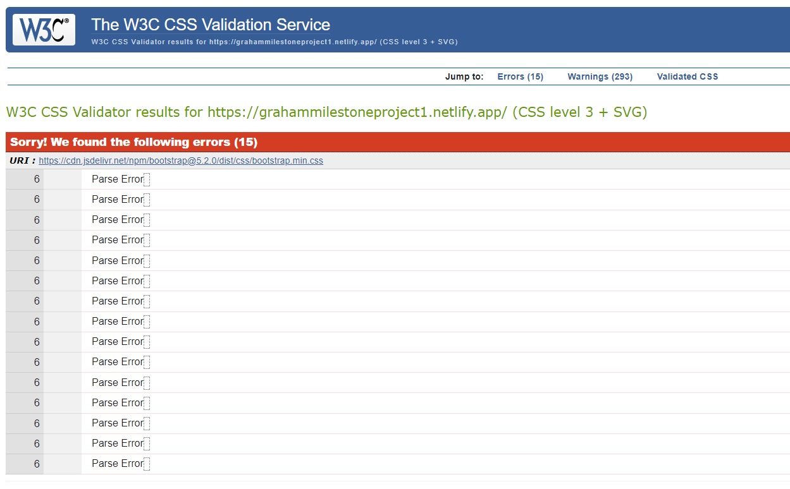
  
 ### 🎯 Additional Testing:
 
 1. Page Links : Tested each page link by checking that each link works from each page and also tested these on desktop, laptop and mobile devices.
 2. Eternal Links : Tested all external links for each page to make sure that their end destination was correct and also did this for desktop, laptop and mobile devices.
 3. Form : As for the form on the contact page. I have tested this by adding Netlify form
 
 ### 🎯 Bugs
 
 No additional bugs were found other than testing fixes as mentioned in the 'Testing the Website' section above.
 
 ### 🎯 Media
 
 All pictures are my own and were supplied to me from my real portfolio folders, including my real CV.pdf file.
 
### 🎯 Potential Future Improvements

1. Color and font changes as I was using default bootstrap values.
2. Add JavaScript for a Hamburger menu when used on mobile devices.
3. Add more Projects and Certifications as career progression changes.
4. Add a backend source for improved contact form sending options.

### 🎯 Deployment

The website will be deployed through Netlify as mentioned in the 'Skeleton' section above.  
 
### 🎯 Credits and Thanks
 
 1. https://getbootstrap.com/docs for main CSS structure of page.
 2. https://fontawesome.com/icons for all icons used on webpage.
 3. https://www.w3schools.com/ for not only their abundance of helpful information but also for providing the CSS and HTML testing tools(Validator/Jigsaw).
 4. Google Chrome Lighthouse extension.
 5. https://ui.dev/amiresponsive for free website to view responsive designs.
